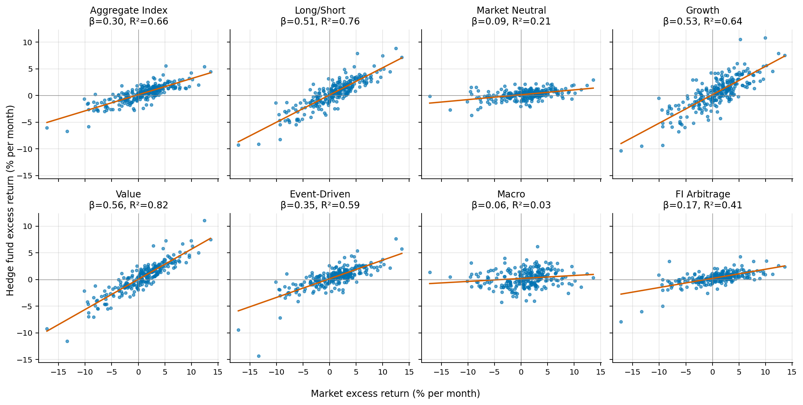
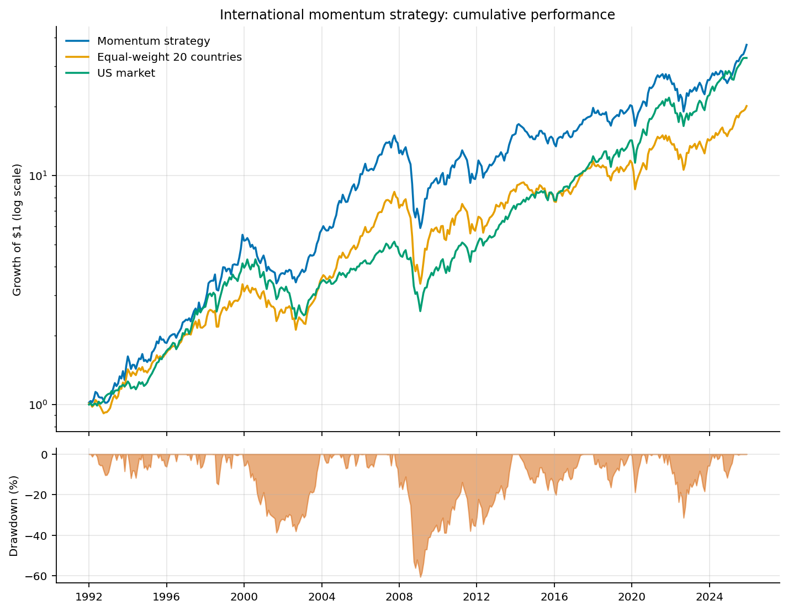
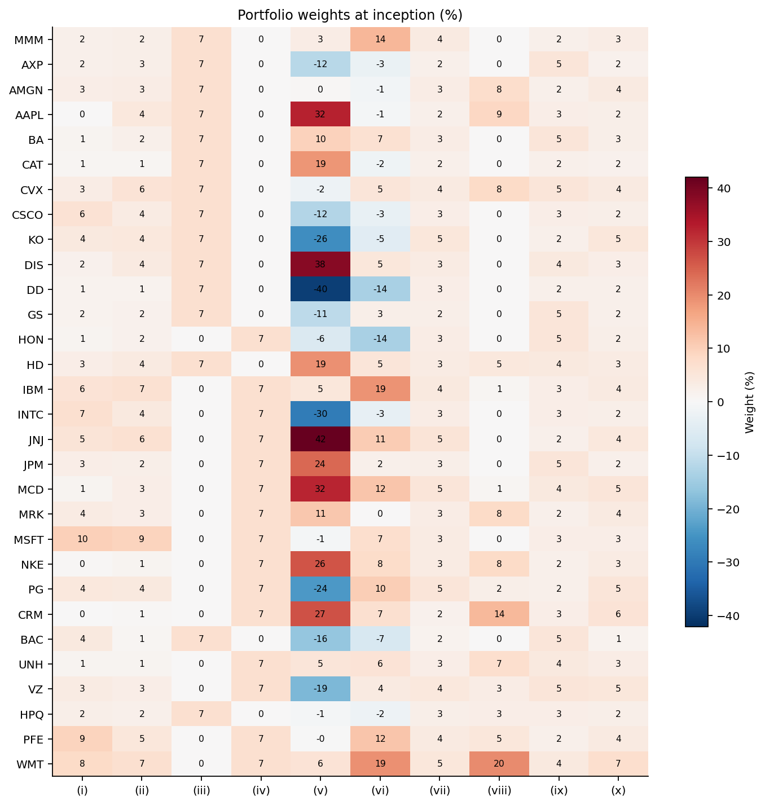
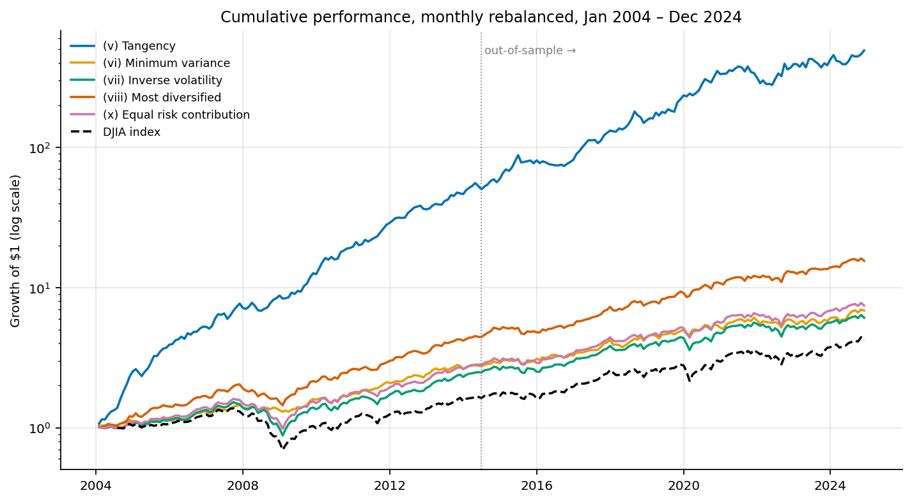
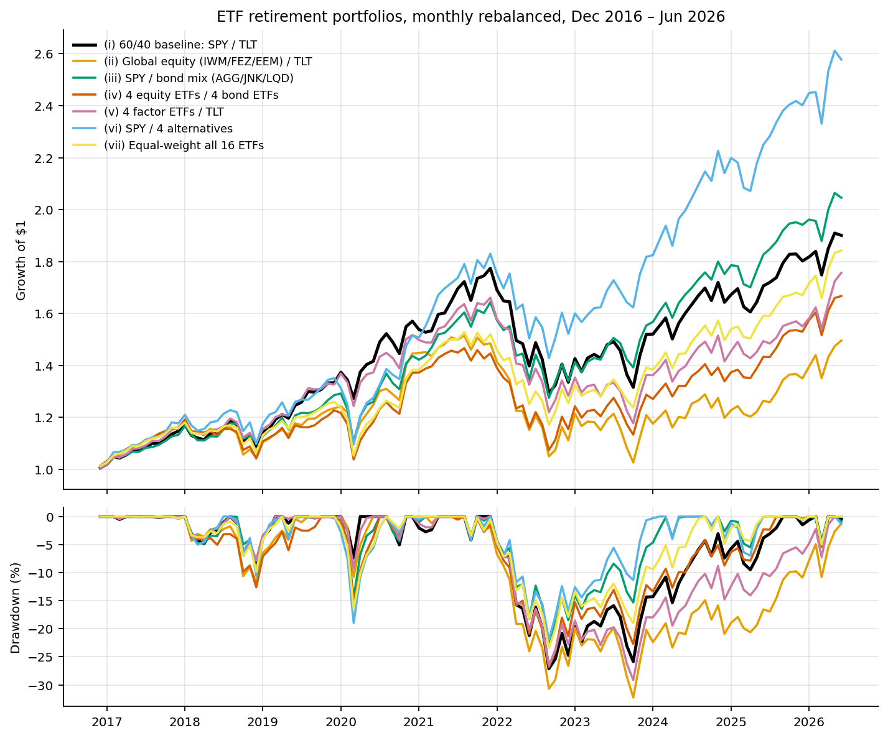
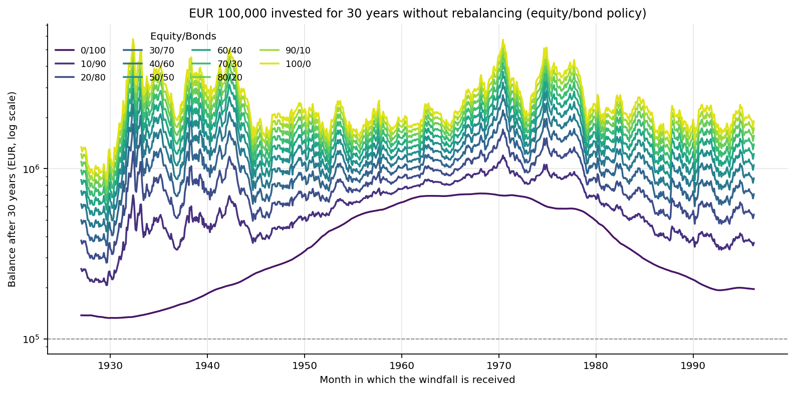
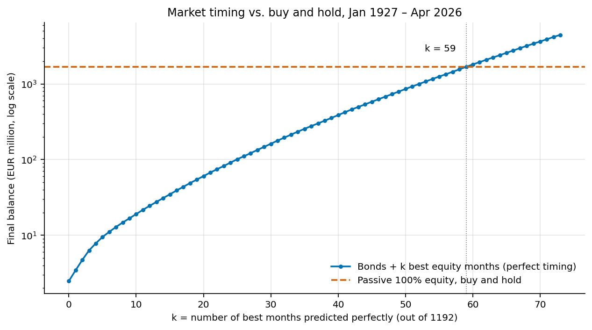

# Introduction and data

This paper answers the five parts of the assignment with monthly data: Fama–French factors and the T‑bill rate (Jan 1927 – Apr 2026), eight HFRI hedge‑fund indices (Jan 2005 – May 2026), USD equity returns of 20 developed markets (Jan 1991 – Dec 2025), prices of the 30 DJIA stocks and the index (Jan 2004 – Dec 2024) and prices of 16 ETFs (Jan 2000 – Jun 2026). All computations are in Python (`main.py`); every table and figure can be regenerated from the code.

Three data issues were found and handled. (1) Three 2:1 stock splits (AAPL Feb 2005, UNH May 2005, CAT Jul 2005) are not adjusted in the price file and would appear as −50 % months; we halve the pre‑split prices. (2) The DJIA column is shifted by six months relative to its date labels (the row labelled Aug 2008 holds 7,062.93, the actual close of Feb 2009); its correlation with the 30 stocks is −0.13 before and +0.97 after re‑aligning, so we shift the series. (3) All price series are price‑only; returns exclude dividends and coupons, which understates bond ETFs and REITs by roughly 3–4 percentage points a year. All returns are converted to decimals, all factor regressions use excess returns over the T‑bill rate, and annualisation is mean × 12 and volatility × √12.

# Part 1 – Hedge funds

**CAPM.** Over Jan 2005 – Apr 2026 (256 months) the aggregate HFRI index has a market beta of 0.30 and an alpha of 1.8 % p.a. (t = 2.5, R² = 0.66). This is the opposite of what the mutual‑fund literature finds: equity mutual funds have betas near one and net alphas around zero or negative. The equity‑oriented styles (Long/Short β = 0.51, Growth 0.53, Value 0.57) are well described by the CAPM (R² 0.64–0.82); Market Neutral (β = 0.09, R² = 0.21), Fixed‑Income Arbitrage (β = 0.17, R² = 0.41) and especially Macro (β = 0.06, R² = 0.03) are not – their scatter plots are shapeless clouds (Figure 1).

{width=100%}

**Four‑factor model.** Adding SMB, HML and MOM raises R² by only 1–5 percentage points (Table 1). The aggregate index loads significantly only on the market and, mildly, on SMB (0.06, t = 2.4); its alpha stays at 1.9 % p.a. The style loadings are economically sensible: Growth loads negatively on HML, Value and Event‑Driven positively on SMB and HML, Market Neutral and Macro positively on MOM (trend following), FI Arbitrage negatively on MOM. The four‑factor model is therefore better, but not good, for non‑equity styles: their drivers (credit, rates, volatility, non‑linear payoffs) are outside the equity factor set.

Table: CAPM and four‑factor results (alpha p.a., t‑statistics of alpha, factor loadings; bold = significant at 5 %).

| Index | α CAPM | t | β_Mkt | R² CAPM | α 4F | t | β_SMB | β_HML | β_MOM | R² 4F |
|------------|---:|---:|---:|---:|---:|---:|---:|---:|---:|---:|
| Aggregate | **1.8 %** | 2.5 | 0.30 | 0.66 | **1.9 %** | 2.6 | **0.06** | 0.01 | 0.02 | 0.67 |
| Long/Short | 1.3 % | 1.4 | 0.51 | 0.76 | 1.5 % | 1.6 | **0.11** | −0.03 | 0.01 | 0.77 |
| Market Neutral | **1.8 %** | 2.9 | 0.09 | 0.21 | **1.6 %** | 2.6 | 0.00 | **0.03** | **0.05** | 0.25 |
| Growth | 1.8 % | 1.4 | 0.53 | 0.64 | 1.9 % | 1.4 | 0.08 | **−0.09** | 0.01 | 0.65 |
| Value | 0.3 % | 0.4 | 0.57 | 0.82 | 0.7 % | 0.8 | **0.11** | 0.04 | −0.02 | 0.83 |
| Event‑Driven | 1.6 % | 1.6 | 0.35 | 0.59 | **2.0 %** | 2.1 | **0.13** | **0.08** | −0.01 | 0.64 |
| Macro | 2.3 % | 2.0 | 0.06 | 0.03 | 1.9 % | 1.6 | −0.03 | 0.05 | **0.07** | 0.06 |
| FI Arbitrage | **2.4 %** | 3.5 | 0.17 | 0.41 | **2.7 %** | 4.0 | 0.03 | 0.00 | **−0.05** | 0.44 |

**Time‑varying beta.** Splitting months into up (Mkt−RF > 0, 164 months) and down markets (92 months) and estimating one regression with an interaction term, the aggregate index has betas of 0.29 (up) and 0.32 (down) – not significantly different. Two styles, however, show the unfavourable asymmetry: Event‑Driven (0.28 up vs 0.42 down, t = −2.5) and FI Arbitrage (0.12 vs 0.22, t = −2.3). They behave like short put options: little participation in rallies, disproportionate losses in sell‑offs (merger spreads and credit spreads widen together with equities). Their unconditional beta overstates the diversification they provide exactly when it is needed, which makes them less attractive than the full‑sample CAPM suggests.

**Autocorrelation.** An AR(1) regression on raw monthly returns gives significantly positive coefficients for five of eight indices: FI Arbitrage 0.43 (t = 7.6), Event‑Driven 0.22 (t = 3.6), Aggregate 0.16 (t = 2.5), Growth 0.15, Market Neutral 0.13; Macro is 0.01 and the market factor itself is 0.00. Positive autocorrelation of this size is the signature of illiquid holdings and return smoothing (Getmansky, Lo and Makarov, 2004). Reported volatility and Sharpe ratios of these styles are therefore overstated and their market betas understated; the smooth styles are the same ones with the bad down‑market beta, so liquidity risk is the common thread.

# Part 2 – International momentum

Each month the 20 countries are ranked on their cumulative return over months t−12 to t−2; the top three receive 4/15 each, the bottom three zero and the other fourteen 1/70 each; the portfolio is held for one month and re‑formed (no costs). The first tradable month is Jan 1992 (408 months to Dec 2025). The benchmark is the equal‑weighted portfolio of the same 20 countries.

Table: Performance Jan 1992 – Dec 2025 (Sharpe with the average T‑bill rate of 2.5 % p.a.; none subtracted for long‑short series).

| | Mean p.a. | CAGR | Vol | Sharpe | Max DD |
|------------------|---:|---:|---:|---:|---:|
| Momentum strategy | **12.2 %** | 11.2 % | 17.6 % | **0.56** | −61 % |
| EW 20 countries | 10.3 % | 9.2 % | 16.9 % | 0.46 | −60 % |
| Winners − Losers | 3.5 % | 2.4 % | 15.1 % | 0.23 | −43 % |
| US market | 11.4 % | 10.8 % | 15.1 % | 0.60 | −50 % |
| US MOM factor | 4.6 % | 3.2 % | 16.2 % | 0.28 | −58 % |

The momentum tilt adds 1.9 % p.a. at unchanged volatility and lifts the Sharpe ratio from 0.46 to 0.56 (Figure 2); $1 grows to $37 versus $20. Because the strategy is long‑only and 80 % concentrated in three countries it keeps the full equity risk (−61 % in 2008–09). Small volatile markets (Finland, New Zealand, Norway, Austria) are the most frequent winners; Japan is the loser in 32 % of all months.

{width=85%}

**Can the four‑factor model explain the profit?** Regressing the winners‑minus‑losers spread on the four factors gives a loading of 0.38 on the US momentum factor (t = 8.3) and nothing else; the active return (strategy minus equal‑weight) loads 0.11 on MOM (t = 5.7). The CAPM alpha of the active return, 2.2 % p.a. (t = 2.1), falls to 1.5 % p.a. and becomes insignificant (t = 1.4) once MOM is included. Country momentum is thus largely the same phenomenon as US stock momentum (Asness, Moskowitz and Pedersen, 2013) rather than an independent anomaly, although the low R² (0.10–0.17) shows that most of its month‑to‑month variation is country‑specific. Its pure momentum component (Sharpe 0.23) is weaker than the US factor (0.28) over the same period.

# Part 3 – Portfolio replication (DJIA stocks)

Ten portfolios are formed from the 30 stocks and held with fixed weights and costless monthly rebalancing over Feb 2004 – Dec 2024; the estimated portfolios (v–viii, x) use return moments from Feb 2004 – Jun 2014. "Prices as of Jan 2024" in the assignment is read as Jan 2004, matching the share counts provided. The full 30 × 10 weight matrix is in `part3_weights.csv` (Figure 3); the salient features are: (i) cap weights are dominated by MSFT 10 %, PFE 9.5 %, WMT 7.9 % with AAPL at 0.3 %; (ii) with 2014 prices AAPL rises to 4.3 %; (v) the tangency portfolio is 300 % long / 200 % short (JNJ +42 %, DIS +38 %, AAPL +32 %, DD −40 %, INTC −30 %); (vi) minimum variance also shorts (DD, HON −14 %); (vii) inverse‑volatility weights lie between 1.6 % and 5.5 %; (viii) the long‑only most‑diversified portfolio holds 15 stocks (WMT 20 %, CRM 14 %); (ix) the equal‑group‑budget portfolio gives 5 % to each Finance and Energy stock but 2 % to each of the ten Manufacturing stocks; (x) ERC weights range from 1.3 % (BAC) to 6.9 % (WMT).

{width=70%}

**Comparability.** Only (i), (iii), (iv), (ix) and the index are implementable on 1 Jan 2004; (ii) and (v)–(viii), (x) use information from 2004–2014 and are in‑sample for the first half. (v) and (vi) contain short positions and leverage; the others are long‑only and fully invested. The risk‑based portfolios (vi, vii, viii, x) form a family that needs no return forecasts and is comparable among itself; (v) is the only one that needs expected returns, the most error‑prone input. (iii) and (iv) hold half the universe each and are really only comparable to each other.

Table: Performance Feb 2004 – Dec 2024, rf = 0, utility = mean − ½·5·σ² (DJIA: Aug 2004 – Dec 2024 after the data correction).

| Portfolio | Mean p.a. | Vol | Skew | Worst month | Sharpe | Utility | Max DD | Corr. DJIA |
|------------------|---:|---:|---:|---:|---:|---:|---:|---:|
| (i) Cap‑weight 2004 | 8.0 % | 13.8 % | −0.24 | −13.0 % | 0.58 | 3.2 % | −45 % | 0.95 |
| (ii) Cap‑weight, 2014 prices | 9.8 % | 13.5 % | −0.24 | −12.2 % | 0.73 | 5.3 % | −41 % | 0.96 |
| (iii) EW first 15 | 11.3 % | 18.4 % | −0.10 | −16.5 % | 0.62 | 2.9 % | −55 % | 0.95 |
| (iv) EW last 15 | 9.9 % | 11.9 % | −0.17 | −9.2 % | 0.83 | 6.3 % | −37 % | 0.90 |
| (v) Tangency | 31.8 % | 19.0 % | 0.09 | −11.4 % | 1.67 | 22.7 % | −26 % | 0.37 |
| (vi) Min. variance | 9.8 % | **10.5 %** | −0.16 | −8.5 % | 0.94 | 7.0 % | **−15 %** | 0.70 |
| (vii) Inverse vol. | 9.6 % | 13.5 % | −0.21 | −12.2 % | 0.71 | 5.0 % | −42 % | 0.98 |
| (viii) Most divers. | 13.9 % | 11.7 % | 0.25 | −8.5 % | 1.19 | 10.5 % | −29 % | 0.78 |
| (ix) Equal group | 10.9 % | 15.3 % | −0.13 | −13.6 % | 0.71 | 5.1 % | −49 % | 0.97 |
| (x) ERC | 10.4 % | 12.6 % | −0.07 | −10.1 % | 0.83 | 6.5 % | −39 % | 0.96 |
| DJIA | 8.1 % | 14.5 % | −0.40 | −14.1 % | 0.56 | 2.9 % | −49 % | 1.00 |

{width=85%}

The cap‑weighted portfolio replicates the index closely (8.0 % vs 8.1 % p.a., correlation 0.95, tracking error 4.7 % p.a.), as do inverse‑volatility (tracking error 3.2 %) and the equal‑group portfolio (3.9 %) – the price‑weighted DJIA is close to an equal‑weighted portfolio of its members. The risk‑based portfolios beat cap weighting also out of sample: minimum variance has the lowest volatility and a drawdown of −15 % in 2008 against −49 % for the index, because it avoids the financials. The tangency portfolio's 31.8 % p.a. is an artefact of look‑ahead: its in‑sample Sharpe ratio is 2.4 and drops to 1.1 after June 2014, and it requires 5× gross exposure with a −40 % short in a single stock (Figure 4). The alphabet portfolios illustrate single‑stock luck: the last 15 names (MSFT, CRM, UNH, NKE) achieve a Sharpe ratio of 0.83, the first 15 (BAC, HPQ, GS, DD) only 0.62.

**Choice on 1 January 2004.** Only portfolios without future information are admissible: (i), (iii), (iv), (ix) or the index. Ex ante the sensible choice is a diversified, estimation‑free portfolio over all 30 stocks – the cap‑weighted replication (i) or, given the evidence on naive diversification already available in 2004, the equal‑weighted/equal‑group portfolio (ix). With risk aversion 5 the utility ranking among admissible portfolios is (iv) > (ix) > (i) ≈ DJIA ≈ (iii), but (iv) is an alphabetical accident. The high utilities of (v), (viii) and (vi) are not attainable by a 2004 investor and demonstrate look‑ahead bias, not skill.

# Part 4 – Retirement management with ETFs

Seven fixed‑weight, monthly rebalanced ETF portfolios are compared. The ETFs start at different dates (the REIT ETF only in Nov 2016), so the fair comparison is the common window Dec 2016 – Jun 2026 (115 months); Sharpe ratios use rf = 1 %.

Table: Common period Dec 2016 – Jun 2026 (price returns, no distributions).

| Portfolio | CAGR | Vol | Sharpe | Max DD | Corr. (i) |
|------------------|---:|---:|---:|---:|---:|
| (i) 60/40 SPY/TLT | 6.9 % | 11.7 % | 0.55 | −27 % | 1.00 |
| (ii) IWM/FEZ/EEM + TLT | 4.3 % | 12.7 % | 0.32 | −32 % | 0.93 |
| (iii) SPY + AGG/JNK/LQD | 7.8 % | 11.4 % | 0.63 | −22 % | 0.94 |
| (iv) 4 equity + 4 bond | 5.5 % | 11.9 % | 0.43 | −27 % | 0.91 |
| (v) 4 factor + TLT | 6.1 % | 11.6 % | 0.48 | −29 % | 0.97 |
| (vi) SPY + 4 alternatives | **10.4 %** | 12.9 % | **0.76** | **−22 %** | 0.89 |
| (vii) EW 16 ETFs | 6.6 % | 11.3 % | 0.53 | −23 % | 0.90 |

{width=85%}

All portfolios are 0.9–0.97 correlated with the baseline; the differences come from two decisions. First, *which equity*: 2017–2026 was the decade of US large caps, so replacing SPY by small caps, Europe and emerging markets (ii) cost 2.6 % p.a. and produced the deepest drawdown; the factor mix (v) also lagged because Value and Size underperformed. Second, *which bonds*: 20‑year Treasuries lost 33 % in 2022 and 51 % from their 2020 peak, falling together with equities. Swapping TLT for a duration‑diversified credit mix (iii) improved return, volatility and drawdown. The alternatives portfolio (vi) leads on every metric, but because listed private equity and infrastructure are equity‑like it is effectively ≈ 90 % equity risk in a strong equity decade, with the highest volatility of the seven. The 1/N portfolio (vii) achieves the lowest volatility and near‑baseline return without any estimation. Recommendation: keep 60/40, diversify the bond sleeve across duration and credit, do not abandon international diversification on the strength of one decade, and treat (vi) as a higher‑risk allocation rather than a free improvement. Because the data are price‑only, bond‑heavy portfolios are understated by about 3–4 % p.a. relative to total‑return figures.

# Part 5 – Windfall investment

**Policy portfolios.** €100,000 is invested once and held for 30 years without rebalancing in eleven stock/bond mixes (market factor / T‑bill), for each of the 832 possible start months from Jan 1927 to Apr 1996.

Table: Averages over 832 start dates (Sharpe with constant rf = 1 %, as prescribed).

| Equity/Bonds | Avg. balance | Worst | Best | Avg. return | Avg. vol | Avg. Sharpe |
|------------------|---:|---:|---:|---:|---:|---:|
| 0/100 | €0.39 m | €0.13 m | €0.71 m | 4.1 % | 0.7 % | 4.1 |
| 20/80 | €0.80 m | €0.28 m | €1.70 m | 7.0 % | 6.3 % | 1.01 |
| 40/60 | €1.22 m | €0.43 m | €2.71 m | 8.5 % | 9.4 % | 0.81 |
| 60/40 | €1.63 m | €0.57 m | €3.71 m | 9.6 % | 11.7 % | 0.74 |
| 80/20 | €2.05 m | €0.72 m | €4.72 m | 10.4 % | 13.8 % | 0.69 |
| 100/0 | €2.46 m | €0.87 m | €5.77 m | 11.1 % | 15.8 % | 0.65 |

{width=90%}

Return rises almost linearly with the equity share while risk rises fastest at the low end, so the Sharpe ratio declines monotonically (the 0/100 value is an artefact of measuring the actual T‑bill return against a fixed 1 %). Over 30 years no start date lost money nominally, even at 100 % equity: the worst all‑equity outcome (a windfall in Aug 1929) still ends at €868k, above the *best* bond‑only outcome. The ranking of the policies is the same for every start date (Figure 6), but the dispersion is large (100/0: €0.9–5.8 m). Without rebalancing a 60/40 portfolio drifts to ≈ 90 % equity after 30 years, so its realised volatility is that of a much more aggressive portfolio and its risk is back‑loaded. Equity returns are best for windfalls received after crashes (1932–33, 1942, 1974–75) and worst for those received at peaks (1929, 1937, 1965–68); bond returns depend on the rate regime and are worst for the 1930s–40s starts. For a genuine 30‑year horizon we would choose 80/20 or 90/10: it retains ≥ 95 % of the equity upside with a buffer against forced selling in a crash.

**Market timing.** From Jan 1927 to Apr 2026 buy‑and‑hold in the market factor turns €100,000 into €1.68 billion (11.1 % p.a.); T‑bills alone give €2.5 m. An investor who holds T‑bills and switches into equities only in the k best months of the entire history reaches €3.4 m with the single best month (Apr 1933, +38.9 %), €19 m with 10, €162 m with 30, €858 m with 50 and overtakes the passive investor only at **k = 59** – 5 % of all months, or one perfectly foreseen month every 20 months, for 99 years (Figure 7). The best months cluster in crises (24 of the 59 before 1946, 12 after 2008), exactly when a timer is least likely to be invested. The evidence therefore strongly favours the passive policy portfolio.

{width=80%}

# Conclusion

Hedge funds deliver low‑beta returns with a modest, statistically significant alpha that survives the four‑factor model, but the smooth returns of the arbitrage styles hide liquidity risk and down‑market exposure. Country momentum exists but is mostly US momentum in disguise. In index replication, simple risk‑based rules beat cap weighting and the seemingly spectacular tangency portfolio is a look‑ahead artefact. For a retirement account the equity choice and the duration of the bond sleeve drove the last decade's differences to 60/40, and the apparent gain from "alternatives" is hidden equity beta. For a 30‑year windfall the historical record favours a high equity share held passively: perfect timing of 59 out of 1192 months would be needed to do better.

\small
*Sources cited: Carhart (1997); Fama and French (2010); Fung and Hsieh (2004); Getmansky, Lo and Makarov (2004); Asness, Moskowitz and Pedersen (2013); DeMiguel, Garlappi and Uppal (2009); Choueifaty and Coignard (2008). Code, tables and figures: project folder, `python main.py`.*
